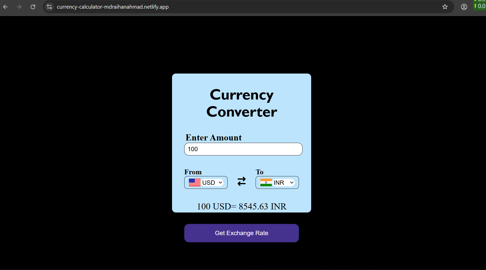

# site link :
# https://currency-calculator-mdraihanahmad.netlify.app/   
🪙 Currency Converter
A simple and responsive Currency Converter web application built using HTML, CSS, and JavaScript. It allows users to convert one currency to another using real-time exchange rates with country flags for an intuitive user experience.  

🚀 Features   
Input any amount to convert  
Select source and target currencies from dropdowns  
Flag icons for selected countries  
Real-time exchange rate fetching  
Swapping between source and destination currencies  

📸 Screenshots 
🏠 Home Screen 

 
